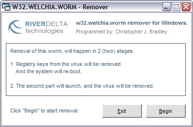



## w32\.welchia\.worm remover

### Description

Removes the Welchia/Nachi worm. No great advance in this code, to the code in my DCOM worm remover. Basically, this will remove the WELCHIA worm, which was released, saw it on the news this morning. Other ways this could be done, is changing the clock to the year 2004, which the worm will remove itself. Also other advances would work in killing the process of the worm before removing it's SERVICES keys in the registry. I know someone has done that with the DCOM remover, great to see people expanding the code. Feel free to advance the code all you like, or leave it as it is, it works.
 
### More Info
 

             |
---                |---
**Submitted On**   |2003-08-15 14:57:48
**By**             |[Chris Blaker](https://github.com/Planet-Source-Code/PSCIndex/blob/master/ByAuthor/chris-blaker.md)
**Level**          |Intermediate
**User Rating**    |5.0 (20 globes from 4 users)
**Compatibility**  |VB 6\.0
**Category**       |[Miscellaneous](https://github.com/Planet-Source-Code/PSCIndex/blob/master/ByCategory/miscellaneous__1-1.md)
**World**          |[Visual Basic](https://github.com/Planet-Source-Code/PSCIndex/blob/master/ByWorld/visual-basic.md)
**Archive File**   |[w32\_welchi1633058202003\.zip](https://github.com/Planet-Source-Code/chris-blaker-w32-welchia-worm-remover__1-47872/archive/master.zip)

